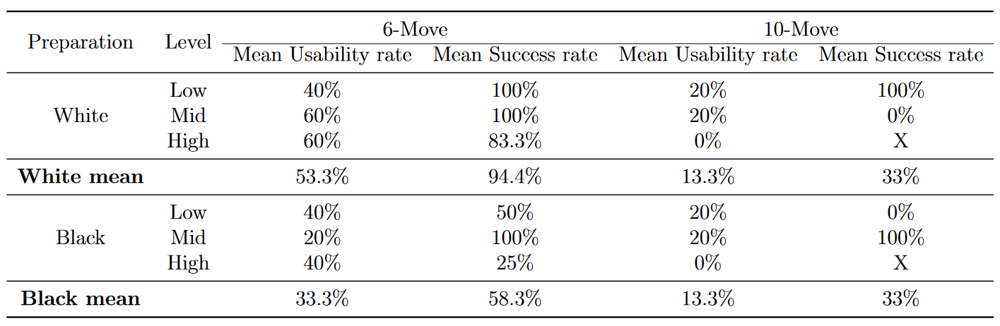

# Chess preparation suggestion

Chess preparation is crucial in competitive play. In tournaments, players often know their pairings in advance, giving them the opportunity to study their opponent's games and gain a significant edge for the upcoming match.

To assist in this process, we have developed an algorithm that suggests tailored preparation against a specific opponent, taking into account both their tendencies and weaknesses.

Our approach has yielded promising results for short sequences across all levels of play. Specifically, for a 6-move preparation, our algorithm successfully applies the sequence in one out of two games and achieves a win rate of nearly 95%.




**For the first version of the model, we suggest using it for short sequences and refining the moves manually. The short sequence will quickly help identify a specific line.**

## How to use it ?

### Clone this repository
```bash
git clone https://github.com/SamyMgi/chess-prep.git
```

### Install the dependencies
```bash
pip install -r requirements.txt
```
### Example of usage

```python
  # Import the class from fressinai.py
  from fressinai import FressinAI

  # Length of the preparation
  prep_length = 6
  # Path of the opponent's games 
  game_path = "../data/training_set.pgn"
  # Opponent's name
  pseudo = ["Menkaoure"]

  # Initialize the class
  fAI = FressinAI(game_path, pseudo, prep_length)
  
  # Get the preparations
  print("White preparation :", fAI.white_prep)
  print("Black preparation :", fAI.black_prep)
```
